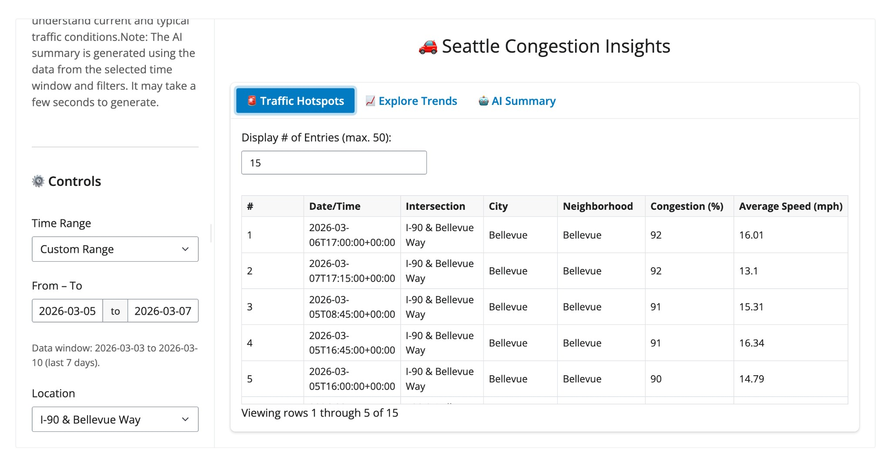
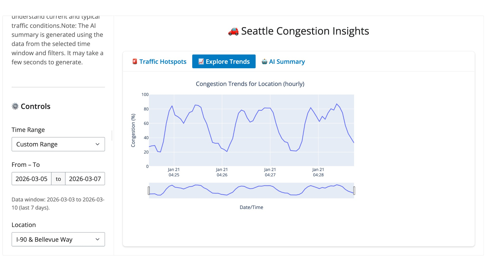
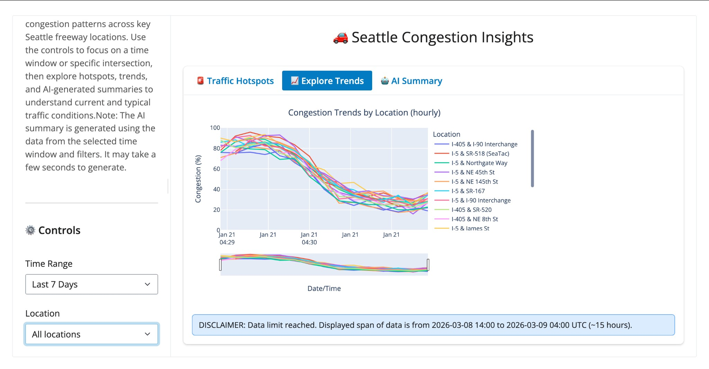
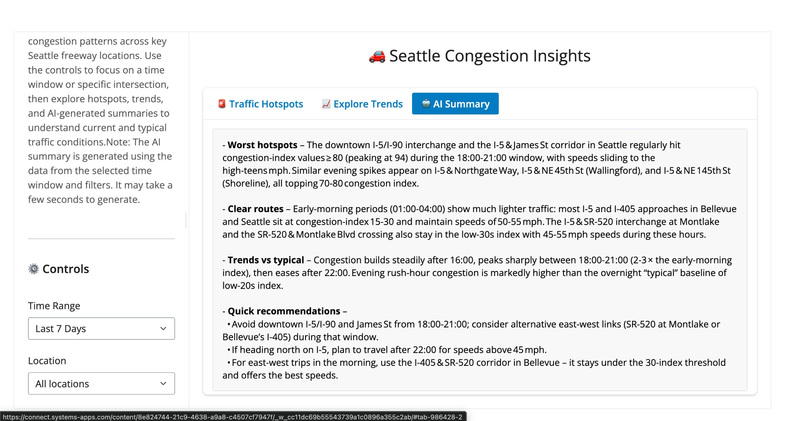
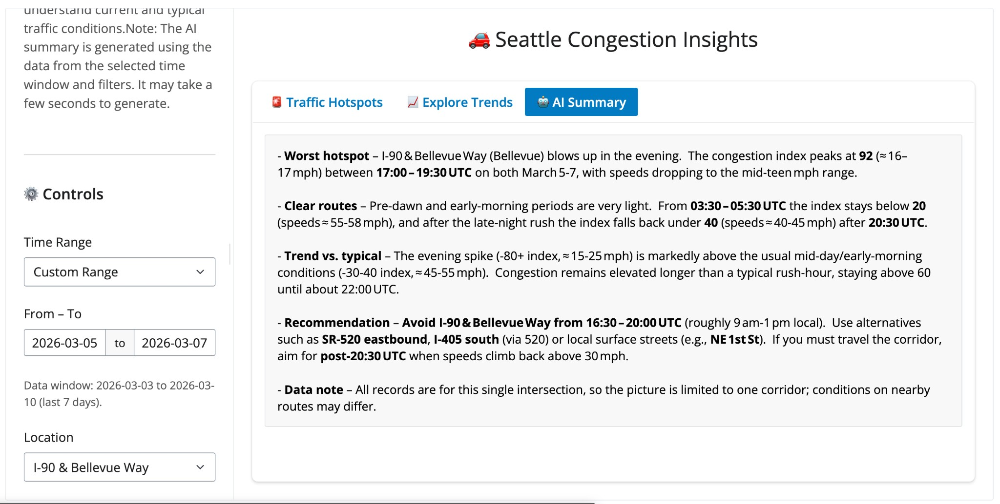
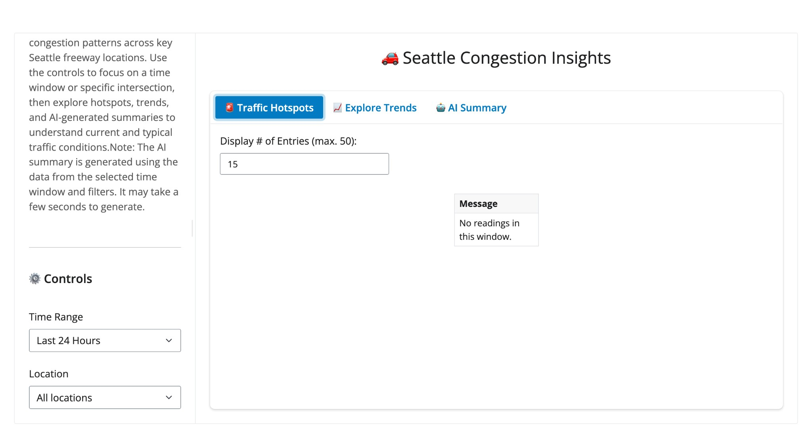
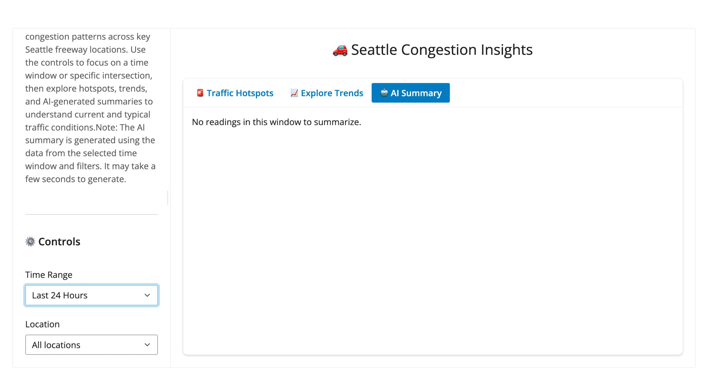

# Test executions for Seattle Congestion Insights

This document defines **2–3 test executions** to demonstrate that the dashboard works correctly. Each test has a **description**, **execution** steps, and a **success case** with a screenshot.

**Prerequisites:** API and dashboard are running (see main [README](README.md) Quick Start). Data is seeded (e.g. `python seed_locations.py` then `python generate_congestion_data.py`).

---

## Test 1: Controls update the data in the tabs

**Description:** Changing sidebar controls (Time Range, Location) must update the data shown in the dashboard tabs (Traffic Hotspots, Explore Trends). The UI is reactive to the selected filters.

**Execution:**

1. Open the Shiny dashboard (e.g. `./run_dashboard.sh` → browser).
2. In the **sidebar**, set **Time Range** (e.g. “Last 7 Days” or “Custom Range” with From–To dates) and **Location** (e.g. “All locations” or a specific intersection such as “I-90 & Bellevue Way”).
3. Open the **Traffic Hotspots** tab and note the table (number of rows, which locations).
4. Change **Time Range** or **Location** and confirm the table updates.
5. Open the **Explore Trends** tab and confirm the chart updates when you change the same controls (e.g. single location vs “All locations”, or different date range).

**Success case:** With valid data for the selected window and location, the Traffic Hotspots table shows rows (e.g. Date/Time, Intersection, City, Congestion %, Speed) and the Explore Trends chart shows a congestion trend line or multiple lines by location. No error messages.

| Traffic Hotspots (data) | Explore Trends (single location) | Explore Trends (all locations) |
|------------------------|-----------------------------------|---------------------------------|
|  |  |  |

---

## Test 2: AI Summary tab generates a new summary

**Description:** Using the AI Summary tab produces an AI-generated summary for the current time window and location. The summary is generated when you view the tab (and when filters change); there is no separate “Generate” button.

**Execution:**

1. In the dashboard sidebar, set **Time Range** (e.g. “Last 7 Days”) and **Location** (e.g. “All locations” or one intersection such as “I-90 & Bellevue Way”).
2. Click the **🤖 AI Summary** tab.
3. Wait a few seconds for the summary to load (Ollama Cloud).
4. (Optional) Change **Time Range** or **Location**, then click back to **AI Summary**; a new or updated summary should be generated.

**Success case:** A block of bullet-point text appears with sections such as **Worst hotspots**, **Clear routes**, **Trends vs typical**, and **Recommendations**. The content refers to congestion and locations and matches the selected filters. No “AI error” or crash.

| AI Summary (all locations) | AI Summary (single location) |
|---------------------------|------------------------------|
|  |  |

---

## Test 3: Error handling — no data shows a clear message

**Description:** When there is no data for the selected filters (e.g. time range with no readings), the app must show a clear, user-facing message instead of crashing or a blank/raw error.

**Execution:**

1. Open the Shiny dashboard with the API running.
2. Set **Time Range** to a window that has no readings (e.g. “Last 24 Hours” when only older data is seeded, or a **Custom Range** outside your seeded dates). Keep **Location** as “All locations” or any choice.
3. Open the **Traffic Hotspots** tab.
4. Open the **Explore Trends** tab (if applicable).
5. Open the **🤖 AI Summary** tab.

**Success case:** Each tab shows a clear message such as “No readings in this window,” “No readings in this window to summarize,” or “Select a time range first”—not a stack trace, blank panel, or uncaught error. The app degrades gracefully.

| Traffic Hotspots (no data) | AI Summary (no data) |
|----------------------------|----------------------|
|  |  |
